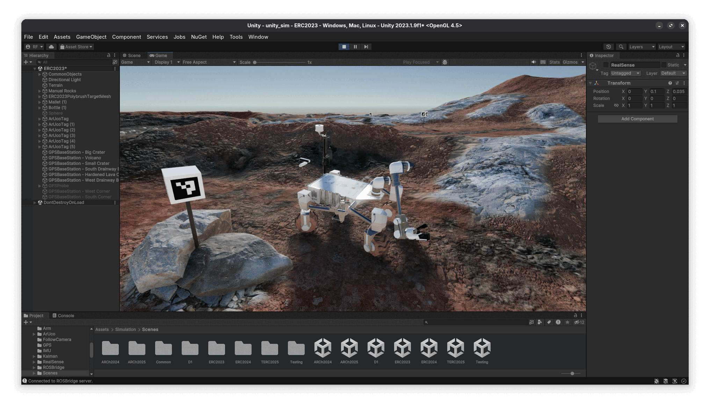

# Unity Simulation

Unity simulation environment for AGH Space Systems robotics projects.



## Table of Contents

- [Runtime Prerequisites](#runtime-prerequisites)
- [Getting Started](#getting-started)
- [IMU Simulation](#imu-simulation)
- [GPS Simulation](#gps-simulation)
- [RealSense Cameras](#realsense-cameras)
- [RealSense Publisher Plugin](#realsense-publisher-plugin)
- [Creating a New Map](#creating-a-new-map)

## Runtime Prerequisites

- CMake 3.20 or newer
- any C++ 20 capable compiler

## Getting Started

Clone the repository to your ROS 2 workspace and build it:

> [!NOTE]
> This is only for standalone usage.
> You can skip this step if you use [`kalman_robot`](https://github.com/agh-space-systems-rover/kalman_robot) since `unity_sim` is already included there as a submodule.

```bash
git clone git@github.com:agh-space-systems-rover/unity_sim.git src/unity_sim
colcon build --symlink-install
source install/setup.bash
```

Once the workspace is built, find out which Unity version is required by this project:

```bash
ros2 run unity_sim unity_version
```

And this command will yield something like `Unity 2023.1.9f1`. (Exact version may differ!)

To setup this version of Unity on your system, you'll need Unity Hub. It can be installed by following the [official instructions](https://docs.unity3d.com/hub/manual/InstallHub.html#install-hub-linux).

> [!TIP]
> Users on Arch Linux can install `unityhub` from the AUR.

Once Unity Hub is installed, it should prompt you to sign into your account in order to activate a personal license. Once logged in, you can install the required version of Unity. Note that Unity Hub only provides download links for the latest versions, so you'll need to access [Unity Archive](https://unity.com/releases/editor/archive) to find the specific version you need. From the archive, you can click a button to open Unity Hub and begin the download.

Once the download is complete, it's a good idea to test your installation by running other demo projects. But you can close Unity Hub for now and proceed to run the simulation:

> [!IMPORTANT]
> Make sure that [runtime prerequisites](#runtime-prerequisites) are installed:
>
> ```bash
> # Arch Linux
> sudo pacman -S cmake base-devel
> # Ubuntu/Debian
> sudo apt install cmake build-essential
> # Fedora
> sudo dnf install cmake gcc-c++
> ```

```bash
ros2 launch unity_sim unity_sim.launch.py
```

On first run, the project will take a while to start as it needs to download some packages from the web and import all the assets. However, future runs will be significantly faster. Unity may still take up to a dozen of seconds to start, so you can use the above command to run the simulation in a new terminal window, while you continue to restart other nodes separately.

If you wish to upgrade the simulation to a newer version of Unity, please open it using Unity Hub. The project directory can be found [here](./unity_project/unity_sim) and will need to be manually selected in Unity Hub.

## IMU Simulation

The simulation provides a virtual IMU sensor. It is a standalone [C# script](./unity_sim/Assets/Simulation/IMU/IMU.cs) that can be attached to any GameObject of choice.

The sensor works by comparing the subsequent positions of the GameObject between subsequent physics frames. This allows it to recover velocity. Then the velocity is compared between subsequent frames to compute acceleration. Angular values are derived in a similar manner.

You can configure the IMU's topic and report frequency in the settings of the script component. Data is published to /imu/data.

## GPS Simulation

By default, a simulated GPS unit is attached as a prefab to Kalman. It is a GameObject with an attached [C# script](./unity_project/unity_sim/Assets/Simulation/GPS/GPS.cs) that searches for GPSBaseStation objects in the scene and uses them as reference points to calculate the GPS position of the unit. The position is published to `/gps/fix`.

You can add an instance of the GPSProbe prefab to your scene and use a button in its custom editor UI to log information about the base stations and the current GPS position of the probe.

Additionally, the probe will log the yaw of the entire Unity world relative to true north, which can be copied into IMU's Yaw Offset field to ensure that the IMU correctly points to the north.

GPSProbe can also be used to bulk-find GPS coordinates of waypoints specified as X,Z positions in a text file, formatted like this:

```
W1 -1.4 2.3
W2 0.5 1.2
...
```

This way you can easily get a list of earth-referenced waypoints that can be imported into the Ground Station.

## RealSense Cameras

In Unity each RealSense is a prefab consisting of a single `GameObject` that contains a camera and a control script. The script renders the camera at a set rate and applies a shader that embeds depth information in the alpha channel of the image.

When a frame is available, it is read by the script onto the CPU, and from there, [native C++ code](./unity_project/unity_rs_publisher_plugin/) sends the unmodified binary buffer over a Unix socket to a `unity_rs_publisher` ROS node.

The node republishes received data as image messages along with `camera_info`. Notably, the node subscribes to `{camera}/unity_rs_publisher/meta` topics to receive camera metadata which is needed to construct the messages.

## RealSense Publisher Plugin

This Unity native plugin forwards live feeds from simulated RealSense cameras, over sockets, to a ROS 2 publisher node.

If the simulation [starts](./unity_sim/unity_sim/unity_sim_node.py) and the plugin is not found at `./unity_project/unity_sim/Assets/Simulation/RealSense/UnityRSPublisherPlugin.so`, it will be automatically compiled.

In order to rebuild the plugin, remove the file and restart the simulation.

## Creating a New Map

During the European Rover Challenge, you typically receive a 3D model of the terrain before the competition. You can use this model to create a new terrain in Unity:

1. Clean the imported 3D geometry.
2. Create a a custom shader that colour points based on their height (pass colour directly to the Surface output, do not use Principled/Diffuse).
3. Disable any tonemappers and post-processing effects.
4. Render the heightmap using an orthographic camera.
5. Save as 16 bit grayscale PNG.
6. Convert to RAW using GIMP.
7. Create a new scene in Unity and Save it to `Assets/Simulation/Scenes/NameOfMyNewScene.unity`.
8. Use Window -> Terrain Toolbox in Unity to import the heightmap and create a terrain.
9. Move the newly generated Assets/Terrain directory to `Assets/Simulation/Scenes/NameOfMyNewScene` folder.
10. Optionally copy over global post processing volume and a skybox from another scene.

You will now have the terrain set up in Unity. While you can later paint textures on it, this is not necessary for the simulation.

Moving on, you can add in the robot and geographic reference points:

1. Instantiate Kalman Prefab in the scene.
2. You can now drive on the terrain.
3. Instantiate the FollowCamera Prefab.
4. Configure the FollowCamera Component on FollowCamera object to follow the Kalman object (to adjust the look-at pos, add an Empty GameObject as a child of Kalman and follow that).
5. Now your view follows the robot.
6. Add at least 3 GPSBaseStation prefabs. Configure each one with the assumed lat/long of the base station.
7. Use GPSProbe to find the world's yaw relative to true north and put that value as IMU's yaw offset in **Kalman -> BaseLink -> IMU**.
8. Now `/imu/data` and `/gps/fix` messages will be published with the correct data. You should be able to see Kalman's pose on the map in Ground Station.

## Adding ArUco Dictionaries

To keep the repository size minimal, only the basic ArUco dictionaries are included.
In case you need to simulate a world with a different type of ArUco tags, you must add a new dictionary to the project:

1. Modify [generate_aruco_textures.py](unity_project/unity_sim/generate_aruco_textures.py) to include the new dictionary.
2. Run the script in its directory to generate new textures in `Assets/Simulation/ArUco/Textures`.
3. Select the new textures in Unity and set their filter mode to **Point (no filter)** and wrap mode to **Clamp**.
4. If the texture size is not a power of 2, set **Advanced -> Non Power of 2** to **None**.
5. Modify [ArUcoTag.cs](unity_project/unity_sim/Assets/Simulation/ArUco/ArUcoTag.cs) to include the new dictionary.

You should now be able to access the new dictionary in the ArUcoTag prefab.
