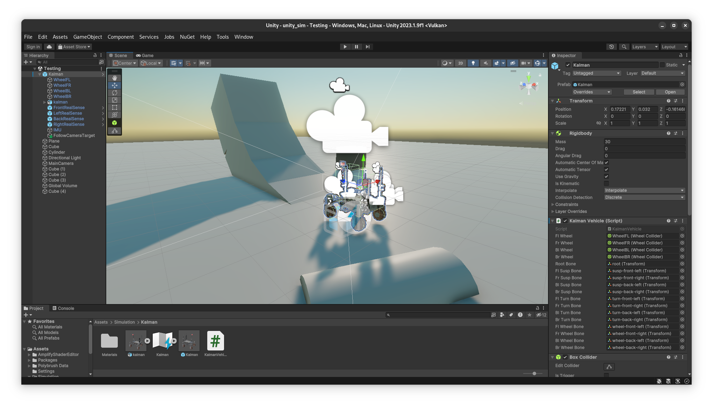

# Unity Simulation

Unity simulation environment for AGH Space Systems robotics projects.

## IMU Simulation

The simulation provides a simulated IMU sensor. It is a standalone [C# script](./unity_sim/Assets/Simulation/IMU/IMU.cs) that can be attached to any GameObject of choice. The sensor works by comparing the subsequent positions of the GameObject between this and previous physics frame. In this way it can recover the velocity. Then the velocity from the previous frame is compared with the current velocity to compute the acceleration. Angular values are calculated in an analogous way. The IMU's topic and report frequency is configurable in the settings of the script component.

## How RealSense Cameras are Simulated

In Unity each RealSense is a prefab composed of a single `GameObject` that contains a camera and the control script. The script renders the camera at a set rate and applies a shader that embeds the depth information in the alpha channel of the image. When a frame is available, it is read by the script onto the CPU, and from there [native C++ code](./unity_sim/unity_rs_publisher_plugin/) in invoked that sends the unmodified binary buffer over a Unix socket to the `unity_rs_publisher` ROS node. The node generates point clouds, image messages and publishes all this data. Camera info is published by Unity itself over ROS Bridge.

## RealSense Publisher Plugin Development

This Unity native plugin is a rather simple piece of code that forwards live feed from simulated RealSense cameras, over sockets, to a ROS 2 publisher node.
It is distributed within this repository in binary form. The component is built for the AMD64 Linux platform. You **DO NOT NEED** to install the below components if you do not plan to develop the plugin and only want to use it.

This software must be installed on the host computer in order to build the plugin:
- CMake
- C++ 20 compiler

The plugin will only be recompiled if the simulation [starts](./unity_sim/unity_sim/__init__.py) and the [binary file](./unity_sim/Assets/Simulation/RealSense/UnityRSPublisherPlugin.so) is not found in the assets folder. That is why you need to manually remove it and restart the simulation to recompile the plugin.

